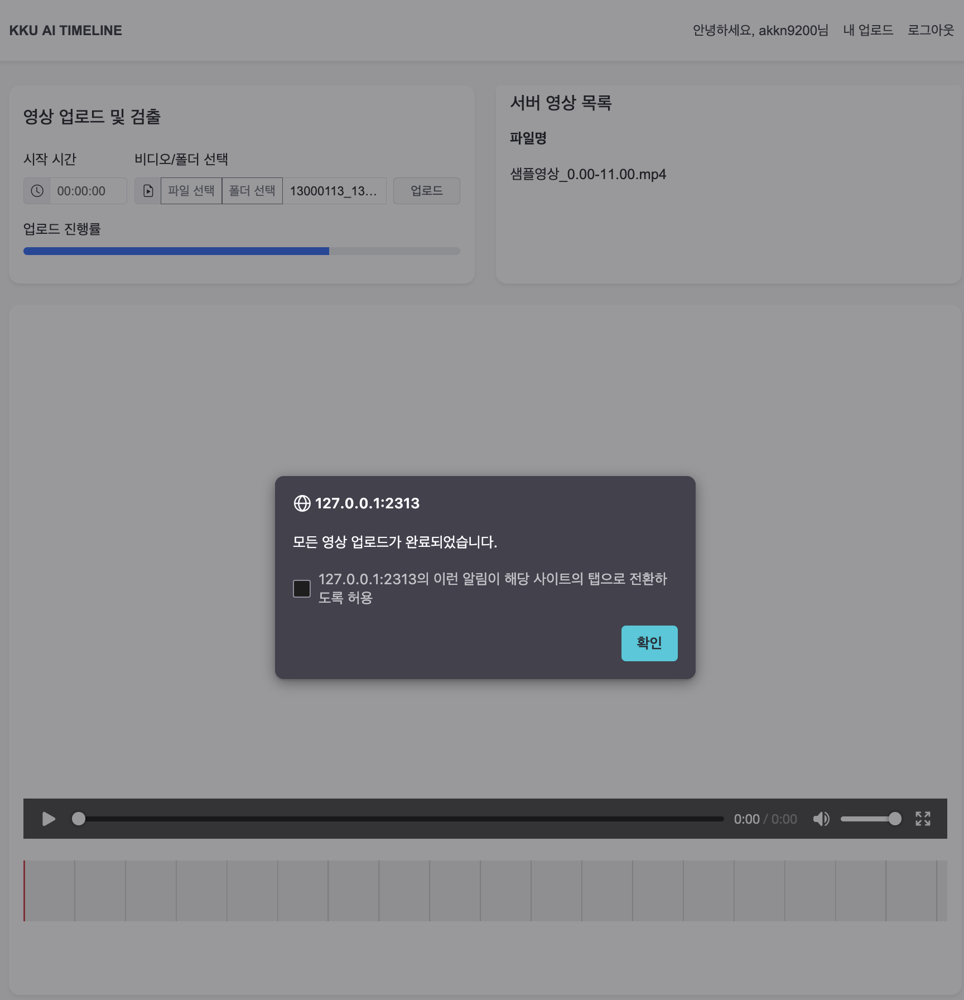
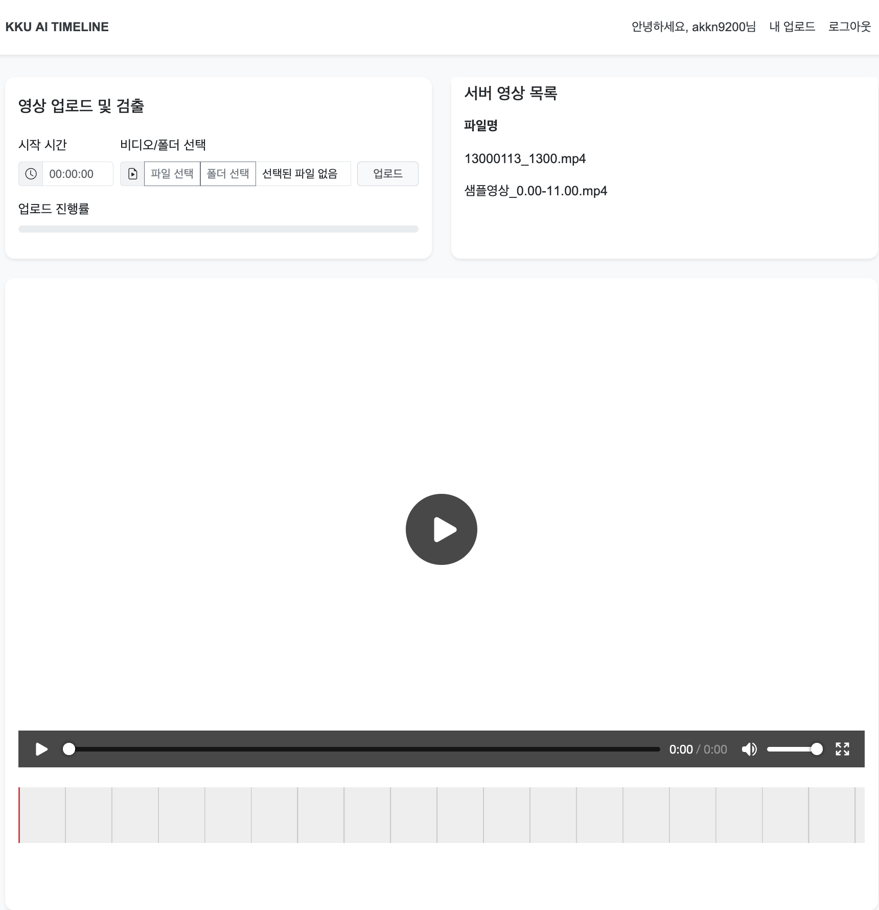
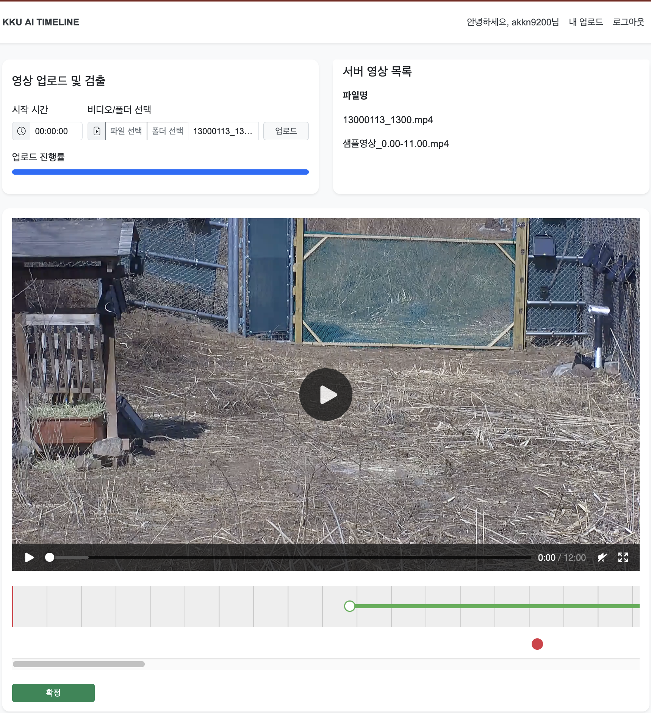
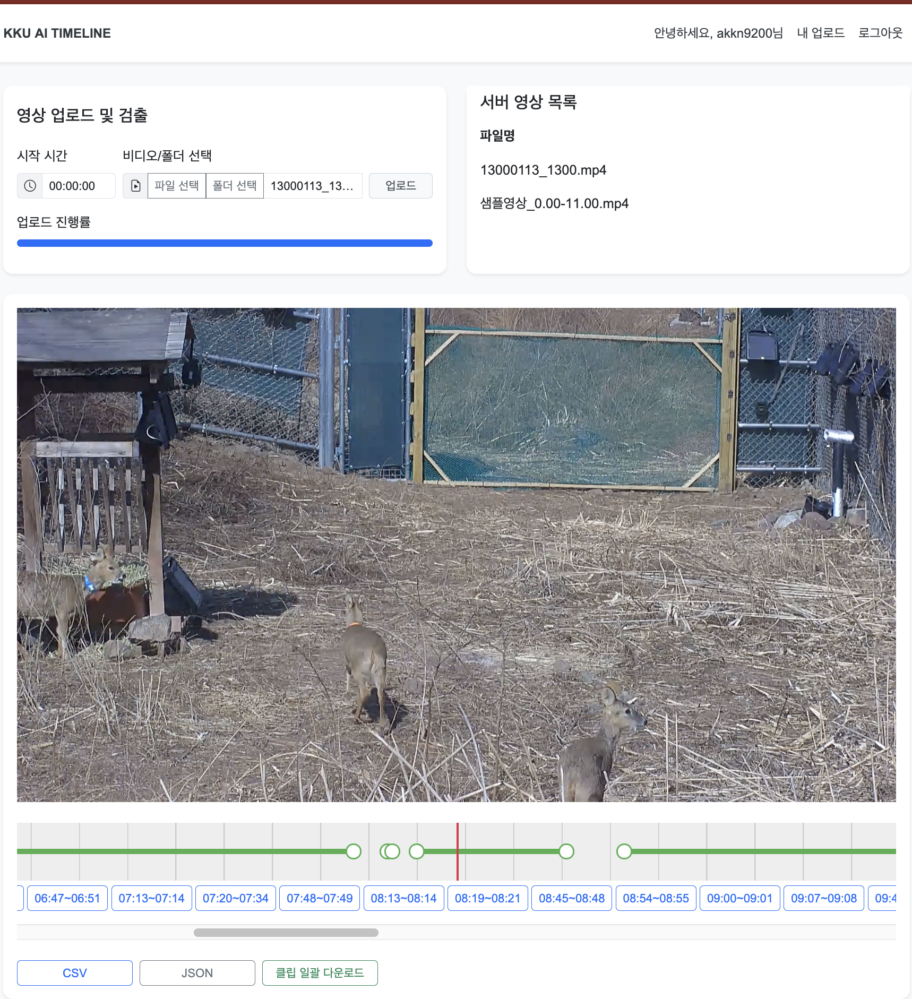
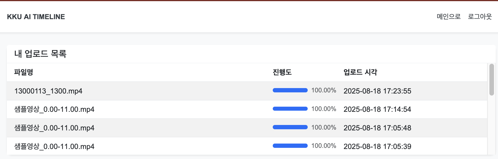
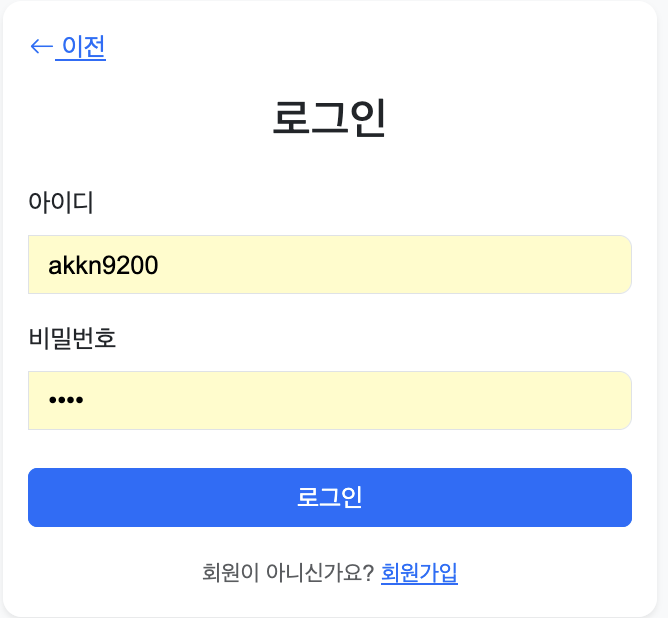
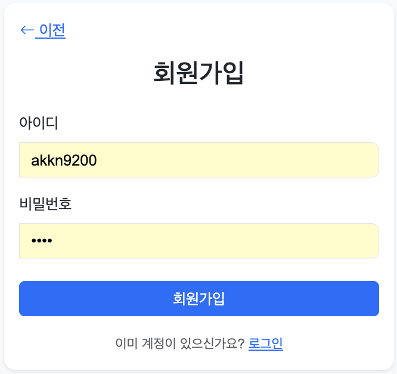
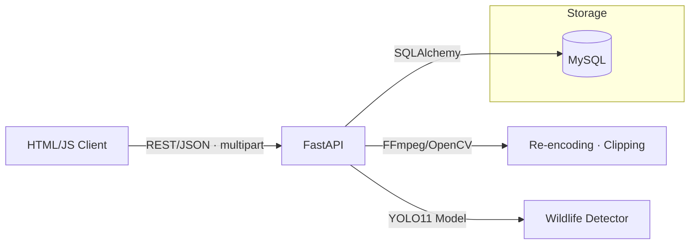

# 동영상 타임라인 검출 서비스 (KKU AI TIMELINE)

[](#)
[](#)
[](#)
[](#-license)

- **국립생태원 요구사항**을 반영해, 업로드된 관찰 영상을 대상으로 **고라니 검출(YOLO11 기반)**을 수행하고,  
- **검출된 시간대만 타임라인으로 시각화**  
- 해당 구간만 **CSV / JSON / MP4**로 내려받을 수 있도록 구현한 서비스입니다.  

또한 **YOLO11 모델을 다른 종 탐지 모델로 교체**하면, 고라니뿐 아니라 **다양한 야생동물로 확장 가능**합니다.


---

## 목차
- [기술 스택](#기술-스택)
- [화면](#화면)
- [핵심 기능](#핵심-기능)
- [아키텍처](#아키텍처)
- [데이터 모델(ERD)](#데이터-모델erd)
- [API 개요](#api-개요)
- [로컬 실행](#로컬-실행)
- [폴더 구조](#폴더-구조)
- [내 역할 & 성과](#내-역할--성과)

---

## 기술 스택


  


---

## 화면

> 저장소에는 **`./assets/`** 폴더에 이미지를 배치해 사용합니다.  
> (`upload_complete_alert.png`, `timeline_initial.png`, `timeline_marking.png`, `timeline_finalized.png`, `my_uploads.png`, `login.png`, `signup.png`)

<p align="center">
  <br/>
  <em>업로드 완료 알림</em>
</p>

<p align="center">
  <br/>
  <em>서버 영상 선택 후 플레이어/타임라인 초기화</em>
</p>

<p align="center">
  <br/>
  <em>검출 시간대 자동 마킹 + 드래그 편집</em>
</p>

<p align="center">
  <br/>
  <em>확정 후 CSV/JSON/클립 버튼 생성 + ZIP 다운로드</em>
</p>

<p align="center">
  <br/>
  <em>회원별 업로드 진행률</em>
</p>

<p align="center">
  
  <br/>
  <em>회원 인증</em>
</p>

---

## 핵심 기능

### 1) 회원별 업로드 & 관리
- **로그인/회원가입** 후 업로드 가능.
- **청크 업로드(1MB)**: `/upload/init`에서 세션/오프셋 → `/upload/chunk` 전송.  
  → 중단 시 **재개 업로드** 가능.
- **비표준 확장자 인코딩 통일**: SEC/AVI 업로드 시 서버에서 **MP4로 변환**.

### 2) YOLO11 기반 검출 + 타임라인
- YOLO11로 **고라니 탐지** 후, 검출된 시간을 타임라인에 자동 표시.
- **연속 5초 이내 시간대 자동 병합** → 사람이 보기 쉽게 정리.
- 각 구간은 **드래그 편집/삭제/자동 병합** 가능.

### 3) 내보내기 (Export)
- 확정 시 `/finalize_segments` → **CSV / JSON / MP4 클립** 생성.
- ZIP 다운로드 버튼 제공.

### 4) 내 업로드 관리
- 업로드된 영상 목록(파일명/진행률/업로드 시각).
- 재선택하여 재검출 가능.

---

## 아키텍처



---

## 데이터 모델(ERD)
```
erDiagram
    users ||--o{ upload_sessions : owns
    users ||--o{ videos          : owns
    videos ||--o{ detections     : contains

    users {
        int id PK
        string username
        string password_hash
        string email
        datetime created_at
    }

    upload_sessions {
        int id PK
        int user_id FK
        string filename
        bigint total_size
        bigint uploaded_size
        datetime created_at
    }

    videos {
        int id PK
        int user_id FK
        string filename
        int progress           "업로드/검출 진행률(%)"
        datetime created_at
    }

    detections {
        int id PK
        int video_id FK
        float start_time       "구간 시작(sec)"
        float end_time         "구간 종료(sec)"
        string species         "탐지된 종 (ex. 고라니)"
        float confidence       "탐지 신뢰도(%)"
        datetime created_at
    }

```

---


## API개요

| 메소드    | 경로                    | 설명                    |
| ------ | --------------------- | --------------------- |
| `POST` | `/upload/init`        | 업로드 세션 생성, 오프셋 조회     |
| `POST` | `/upload/chunk`       | 청크 업로드/재개             |
| `GET`  | `/api/videos`         | 서버 영상 목록              |
| `POST` | `/extract_frames`     | 프레임 추출 및 YOLO11 검출    |
| `POST` | `/finalize_segments`  | 세그먼트 확정 → CSV/JSON/클립 |
| `GET`  | `/download_zip/:file` | ZIP 다운로드              |

---

## 로컬 실행
```
# 1) 가상환경 생성 및 패키지 설치
python -m venv .venv
source .venv/bin/activate  # (Windows: .venv\Scripts\activate)
pip install -r requirements.txt

# 2) FastAPI 서버 실행
uvicorn main:app --reload

# 3) 프론트 (HTML/JS는 templates/static에서 서빙)
#    http://localhost:8000 접속
```

---

## 폴더 구조
```
CCTV_Timeline/
├── __pycache__/                 # 파이썬 캐시
│
├── static/                      
│   ├── css/
│   │   └── style.css            # 스타일시트
│   ├── detections/              # 검출 결과 저장 (CSV/JSON/클립)
│   ├── frames/                  # 추출된 프레임 저장
│   └── js/
│       ├── app.js               # 메인 프론트 로직 (업로드/타임라인)
│       └── sw.js                # Service Worker (업로드 재개용)
│
├── uploads/                     # 업로드된 원본 영상 저장
│
├── templates/                   # HTML 템플릿
│   ├── index.html               # 메인 업로드 + 검출 페이지
│   ├── login.html               # 로그인 페이지
│   ├── my_uploads.html          # 내 업로드 목록
│   └── signup.html              # 회원가입 페이지
│
├── all_yolo11x_imgsz640_orgin.pt # YOLO11 학습된 가중치 파일
├── app.py                       # FastAPI 엔트리포인트
├── requirements.txt             # 파이썬 의존성
└── .gitignore                   # Git 무시 파일
```

---

## 내역할 & 성과
내 역할 & 성과  
수작업 집계 보조: 타임라인 시각화 + CSV로 고라니 출현 구간 집계 가능.  
영상 활용성 향상: 특정 구간만 잘라 MP4 클립 추출.  
대용량 안정성: 청크 업로드 + 재개 지원.  
표준화: 비표준 확장자 인코딩(MP4) 통일.  
확장성: YOLO11 모델 교체 시, 다른 동물 종도 동일 방식으로 처리 가능.  
